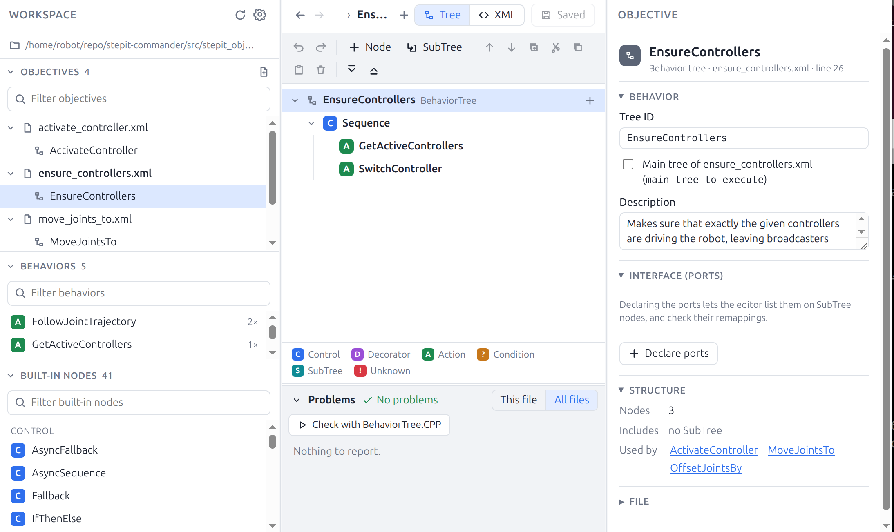
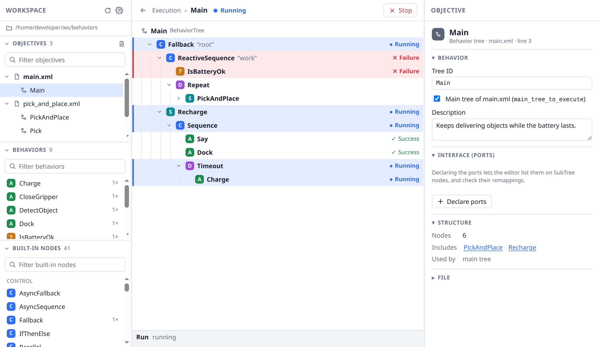

# StepIt Editor

## Table of Contents <!-- omit in toc -->

- [StepIt Editor](#stepit-editor)
  - [Introduction](#introduction)
  - [Prerequisites](#prerequisites)
  - [Install the StepIt Editor](#install-the-stepit-editor)
    - [Check out the Git Repository](#check-out-the-git-repository)
    - [Build the Project](#build-the-project)
  - [Running the Application](#running-the-application)
  - [Using the Editor](#using-the-editor)
  - [Running a Tree on the Robot](#running-a-tree-on-the-robot)
  - [How Files Are Read and Written](#how-files-are-read-and-written)
  - [Validation](#validation)
  - [Your Own Node Types](#your-own-node-types)
  - [Project Layout](#project-layout)
  - [Monitoring a Run from Another Server](#monitoring-a-run-from-another-server)

## Introduction

The StepIt Editor is a web application to edit the behavior trees of [BehaviorTree.CPP](https://www.behaviortree.dev/) 4, the C++ library many robots use to decide what to do next. It opens a folder of behavior tree XML files and shows each tree as an indented list: we can add, move and configure nodes, fill in their ports and save the XML back. The trees are checked as we type, and BehaviorTree.CPP itself can load them to confirm they are valid.



## Prerequisites

We need a computer with Ubuntu 24.04. The preferred way to run the editor is inside a Docker container, which also builds BehaviorTree.CPP for the full validation. Please refer to the document [Install Docker Engine on Ubuntu](https://docs.docker.com/engine/install/ubuntu/).

If you want to run the editor on your host machine instead, you must install [Node.js](https://nodejs.org/) 24 and enable pnpm with `corepack enable`. The validation by BehaviorTree.CPP is then skipped, unless the library is installed too.

## Install the StepIt Editor

### Check out the Git Repository

```
git clone git@github.com:kineticsystem/stepit-editor.git
```

### Build the Project

The Docker container is defined in [`docker/docker-compose.yml`](docker/docker-compose.yml) and driven by the [`docker/dock.sh`](docker/dock.sh) script. See [docker/README.md](docker/README.md) for more details.

> [!IMPORTANT]
> The docker container provides a default user `developer` with password `developer`.

Build the image and create the container. The first build compiles BehaviorTree.CPP, so it takes a few minutes:

```
./docker/dock.sh editor build
```

Start the container with an interactive shell, giving it the folder of behaviors to edit. Without a folder, it opens the examples in [`behaviors`](behaviors):

```
./docker/dock.sh editor start ~/my_robot/behaviors
```

Inside the container the scripts in [`bin`](bin) are on the `PATH` and aliased, so they can be called from any directory. Outside the container, call them by their path instead, e.g. `./bin/update.sh`.

Install all required dependencies.

```
update
```

Build the editor and the BehaviorTree.CPP validator.

```
build
```

Execute all tests.

```
test
```

## Running the Application

Inside the container, start the editor, then open <http://localhost:8080> in a browser.

```
serve
```

From outside the container, the same can be done in one step: this starts the container, installs the dependencies, builds and serves the editor. Stop it with `Ctrl+C`.

```
./docker/dock.sh editor serve ~/my_robot/behaviors
```

To use another port, choose it when starting the container: inside the container the editor always runs on port 8080, and `EDITOR_PORT` sets the port of the host it is published on.

```
EDITOR_PORT=9000 ./docker/dock.sh editor serve ~/my_robot/behaviors
```

Without Docker, set the folder and the port with `BEHAVIORS_DIR` and `PORT`:

```
BEHAVIORS_DIR=~/my_robot/behaviors PORT=8080 ./bin/serve.sh
```

We can open another folder from the editor too, by clicking the folder path at the top left, among the folders of our home folder, or of `BEHAVIORS_BASE` when it is set. In Docker, the editor only sees the folder mounted when the container was started, at `~/behaviors`: to edit a folder outside it, start the container again with that folder, e.g. `./docker/dock.sh editor serve ~/other_robot/behaviors`.

> [!IMPORTANT]
> The server listens on all network interfaces, so anyone on the network can open it. On the host, add `HOST=127.0.0.1` to keep it to your machine.

## Using the Editor

- **Workspace** (left): **Objectives** lists the XML files of the folder and the trees in each. **Behaviors** lists our node types, declared in a `<TreeNodesModel>`, with how often each is used; click one to see its ports and where it is used, or drag it onto the tree. **Built-in nodes** lists BehaviorTree.CPP's own nodes (Sequence, Fallback, RetryUntilSuccessful…), which work the same way.
- **Tree** (center): the selected tree as a collapsible list. Add nodes and SubTrees, drag them around, cut, copy, paste and undo. Open a SubTree to edit the tree it includes, and use the arrows at the top to go back. The **XML** tab shows the file as it will be saved.
- **Disabling a node**: select it and press **D**, or click ⊘ in the toolbar or on its row, to keep it in the file without running it. The editor writes `_skipIf="true"`, so BehaviorTree.CPP skips the node, which returns SKIPPED, and greys it out together with everything below it. A node that already had a `_skipIf` condition keeps it, as `true || (condition)`, and gets it back when enabled again.
- **Details** (right): the selected node's name, ports, scripts (`_skipIf`, `_onSuccess`…) and notes, or, with no node selected, the tree's ID, description and ports.

## Running a Tree on the Robot

The **Run** button sends the open tree to a [BehaviorTree.ROS2](https://github.com/BehaviorTree/BehaviorTree.ROS2) server, which runs it on the robot. The editor talks to the server through [rosbridge](https://github.com/RobotWebTools/rosbridge_suite), so it needs no ROS itself. [StepIt Commander](https://github.com/kineticsystem/stepit-commander) starts rosbridge by default; with another server, start rosbridge next to it, e.g.:

```
ros2 launch rosbridge_server rosbridge_websocket_launch.xml
```

The dialog lists the payload the tree reads, i.e. every `{@key}` of the global blackboard, with YAML values such as `3.0` or `[joint1, joint2]`. By default the editor connects to `ws://<host>:9090` and calls the action `/commander/execute_objective`; both can be changed under *Connection*.

Unsaved changes are saved first, and StepIt Commander reads the tree files again before each goal whenever one changed, so the tree runs as just saved, new files included.

> [!IMPORTANT]
> Other BehaviorTree.ROS2 servers read the tree files when they start, and again only when one of their parameters changes. With them, make the server reload what you just saved before running it, e.g. by setting its folders to the same value: `ros2 param set /<server> behavior_trees "[<package>/<folder>]"`.

## How Files Are Read and Written

All the XML files in the folder, sub-folders included, form one workspace, the way an application that registers every file in one `BehaviorTreeFactory` sees them: a SubTree can refer to a tree of any file, and a node type declared in any file's `<TreeNodesModel>` can be used everywhere. The editor declares new node types in the file that already declares the most (e.g. a `nodes.xml`).

Saving rewrites the whole file with two-space indentation and one element per line. Comments are kept, and so are elements the editor does not know, such as `<include>`. Only BTCPP format 4 is supported.

A file may change on disk while it is open, e.g. edited by hand, pulled from Git or saved from another tab. The editor never overwrites such a change unseen: saving asks whether to overwrite it or to reload the file and drop our edits. Reloading the folder keeps our unsaved edits, and tells which of their files changed on disk.

## Validation

Two layers, both run on unsaved edits too:

1. **The editor's checks** run on every change and mark the offending rows: XML syntax, unknown node types, the number of children per node (a Decorator has one, IfThenElse two or three, Switch3 four…), unknown ports, input ports without a value or default, literals of the wrong type (`num_cycles="many"`), output ports that are not `{blackboard}` references, SubTrees pointing to missing trees, recursive SubTrees, duplicate tree IDs, and a `main_tree_to_execute` that does not exist.
2. **BehaviorTree.CPP itself** (the *Check with BehaviorTree.CPP* button): the program in `validator/` registers each declared node type as a dummy with its declared ports, registers every file and instantiates every tree, then reports what the library refuses. This catches whatever the first layer misses, with the library's own messages. It needs the library, so it is built in the container only.

The same checks run from the command line, e.g. in CI or a pre-commit hook; the exit code is 1 on any error. Inside the container:

```
validate [folder] [--json] [--editor-only]
```

## Your Own Node Types

Nodes implemented in C++ are unknown to the editor until they are declared in a `<TreeNodesModel>` somewhere in the folder. Rather than writing that by hand, generate it from your real registration, so that it includes the ports added behind your back (behaviortree_ros2's `action_name`, `service_name`, `topic_name`):

```cpp
BT::BehaviorTreeFactory factory;
registerNodes(factory, BT::RosNodeParams());    // your registration function
std::cout << BT::writeTreeNodesModelXML(factory, false);
```

Save the output in the folder, e.g. `models/my_nodes.xml`, and add a test that fails when it is out of date. The editor shows a file of models only as a list of node types, and does not let you edit a model in a file whose header comment says it is generated. XML files that are not behaviors (whose first element is not `<root>`, like a ROS `package.xml`) are ignored.

## Project Layout

To learn how the editor is built, start with [docs/ARCHITECTURE.md](docs/ARCHITECTURE.md).

```
bin/          update, build, serve, dev, test and validate scripts
docker/       the container
behaviors/    example behaviors, the default folder
src/shared/   XML model, parser and writer, workspace index, checks (browser and Node.js)
src/server/   the HTTP API over the folder, and the runner of the native validator
src/client/   the React editor
src/cli/      the command line validator, run by bin/validate.sh
validator/    the BehaviorTree.CPP validator (C++)
tests/        unit tests (vitest)
docs/         the architecture document and the screenshot
```

## Monitoring a Run from Another Server

While a tree runs, the editor shows the status of each node only if the server reports it. To report the statuses, return a JSON message from `onLoopFeedback()` of your `TreeExecutionServer`:

```json
{"tree": "<root>...</root>", "nodes": {"3": "RUNNING", "4": "FAILURE"}}
```

- `tree`, in the first message only: `BT::WriteTreeToXML(tree, true, false)`, which gives every node its `_uid`.
- `nodes`: the nodes whose status changed since the previous message, by `_uid`: `RUNNING`, `SUCCESS`, `FAILURE` or `SKIPPED`. Record them with a `BT::StatusChangeLogger`, keep the last status other than `IDLE`, and send them after the last tick too.

`ExecutionStatus`, in `src/stepit_server` of [StepIt Commander](https://github.com/kineticsystem/stepit-commander), does exactly this and can be copied.


