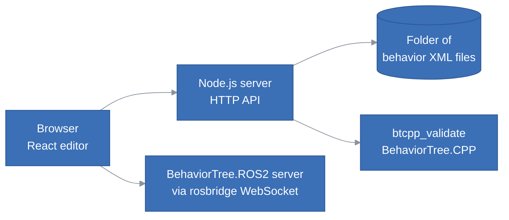
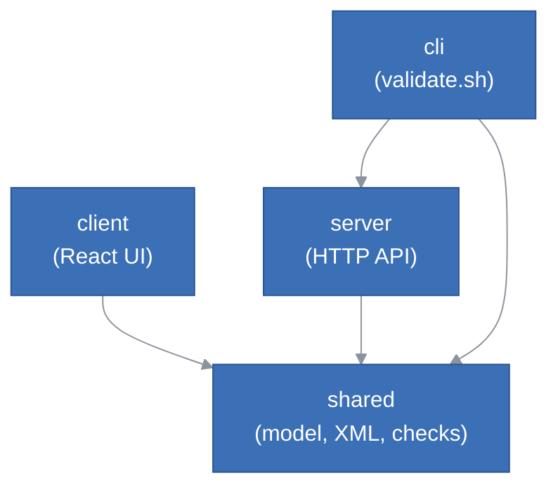
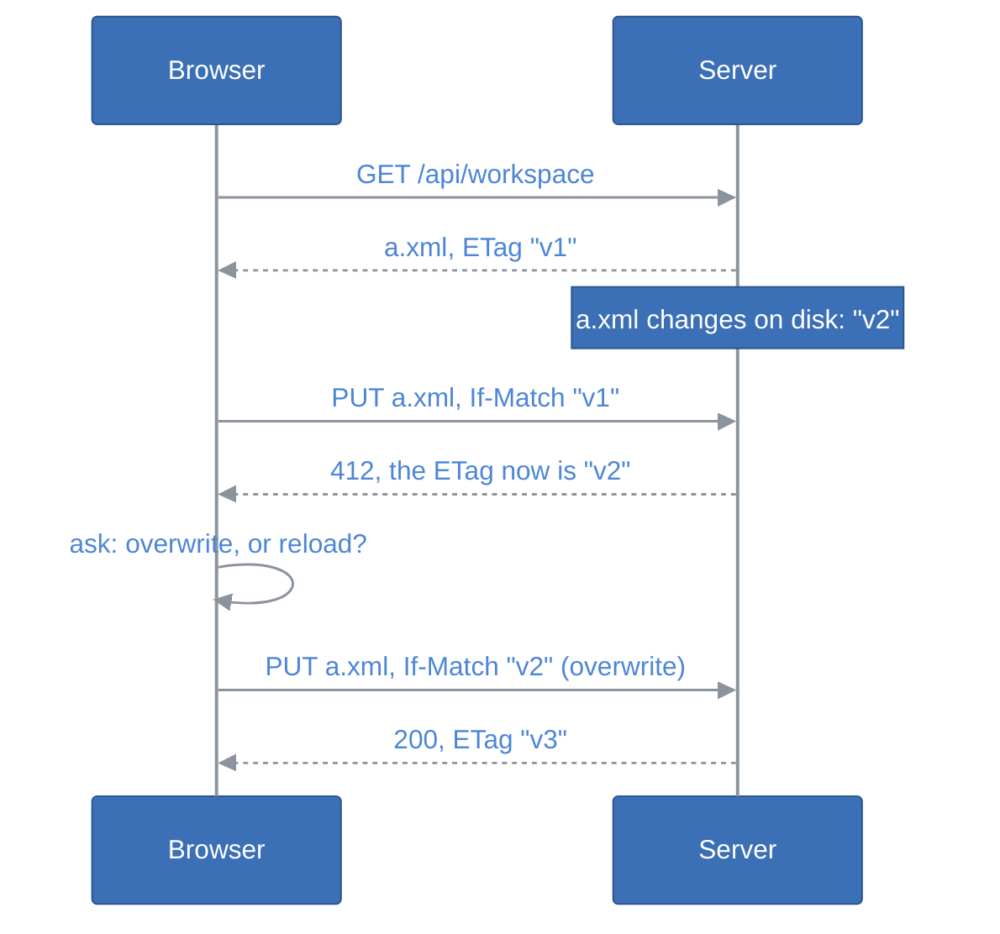
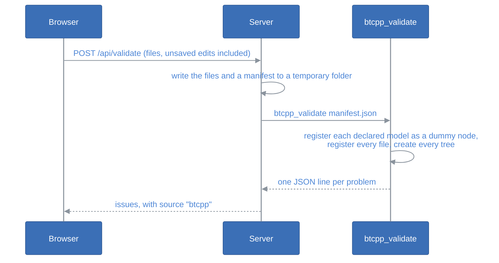
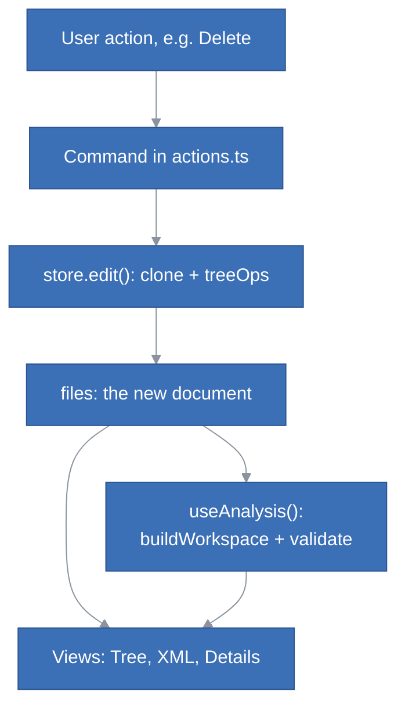

# StepIt Editor Architecture

## Table of Contents <!-- omit in toc -->

- [StepIt Editor Architecture](#stepit-editor-architecture)
  - [Introduction](#introduction)
  - [The Big Picture](#the-big-picture)
  - [The Layers](#the-layers)
  - [The Shared Core](#the-shared-core)
    - [The Document Model](#the-document-model)
    - [Parsing and Writing XML](#parsing-and-writing-xml)
    - [The Workspace Index](#the-workspace-index)
    - [The Editor's Checks](#the-editors-checks)
    - [Tree Operations](#tree-operations)
  - [The Server](#the-server)
    - [Saving Safely](#saving-safely)
  - [The Native Validator](#the-native-validator)
  - [The Client](#the-client)
    - [The Store](#the-store)
    - [From a Click to the Screen](#from-a-click-to-the-screen)
    - [Commands](#commands)
    - [Components](#components)
    - [Running a Tree](#running-a-tree)
  - [The Command Line Validator](#the-command-line-validator)
  - [Tests](#tests)
  - [How to Extend the Editor](#how-to-extend-the-editor)
  - [Design Decisions and Trade-offs](#design-decisions-and-trade-offs)

## Introduction

This document explains how the StepIt Editor is built, what each part is responsible for, and where to start when we want to change something. It assumes we have read the [README](../README.md) and used the editor once.

It follows one idea: **the XML files are the truth**. The editor reads them into a model, lets us change the model, and writes them back with nothing lost, so the files can still be edited by hand, reviewed in Git and loaded by the robot.

## The Big Picture

The editor is a single-page React application served by a small Node.js server. The server owns the folder of behaviors on disk; the browser holds everything else: the parsed files, the unsaved edits, the undo history and the checks.

- The **browser** talks to the server over a tiny JSON API: list the files, save one, delete one, validate, open another folder.
- The **server** reads and writes files, and runs the native validator when it is built. It does not parse behaviors for the editor: the browser does.
- The **native validator** is an optional C++ program that loads the files with BehaviorTree.CPP itself, the final word on whether a tree is valid.
- The **robot** is reached directly from the browser through rosbridge, not through our server, to run a tree.

## The Layers

The source code lives in [`src`](../src) and is split by where it runs:

| Folder | Runs in | Responsibility |
|---|---|---|
| [`src/shared`](../src/shared) | Browser and Node.js | The model of a behavior file, the XML parser and writer, the workspace index, the checks, the tree edits. No I/O, no React. |
| [`src/server`](../src/server) | Node.js | The HTTP API over the folder, the production server, the runner of the native validator. |
| [`src/client`](../src/client) | Browser | The React user interface, its state and its commands. |
| [`src/cli`](../src/cli) | Node.js | The command line validator, for CI and pre-commit hooks. |
| [`validator`](../validator) | Native | The C++ program that loads the files with BehaviorTree.CPP. |

The dependencies point one way: everything may use `shared`, and `shared` uses nothing else.

The client also imports a few *types* from the server, such as the shape of the API responses, but never its code.

> [!IMPORTANT]
> Keep `src/shared` free of I/O, of `node:` modules and of React: it is bundled into the browser and run by Node.js. This is what lets the editor, the server and the CLI agree on what a valid behavior is.

## The Shared Core

### The Document Model

[`src/shared/types.ts`](../src/shared/types.ts) defines the in-memory model of a behavior file. It is worth reading first, since every other file speaks this language.

- A **`BTDocument`** is one XML file: the attributes of `<root>` (e.g. `BTCPP_format`, `main_tree_to_execute`) and a list of **items** in file order. An item is a `<BehaviorTree>`, a `<TreeNodesModel>`, a comment, or a **raw** element the editor does not understand, such as `<include>`, kept verbatim.
- A **`BehaviorTreeDef`** is a `<BehaviorTree>`: its ID, its attributes and its children.
- A **`BTNode`** is a node of a tree. Its `id` is the registration ID, e.g. `Sequence` or `MoveTo`, while its `tag` is the XML element name, which differs in the explicit form `<Action ID="MoveTo"/>`. Its `attrs` are the ports and special attributes (`name`, `_skipIf`…) in document order, and its `comments` are the comments that precede it in the file.
- A **`NodeModel`** is the declaration of a node type in a `<TreeNodesModel>`: its category (Action, Condition, Control, Decorator or SubTree) and its ports. Built-in nodes, such as `Sequence`, are node models too, flagged `builtin`.
- An **`Issue`** is a problem found by a check: its severity, its message, and where it is (file, tree, node, line).

Every node and tree has a **`uid`**, e.g. `n42`, given by the parser. It identifies a node while we edit, for the selection, drag and drop and issues, but it is never written to the file, so reloading the folder gives new uids.

### Parsing and Writing XML

[`src/shared/xml.ts`](../src/shared/xml.ts) turns the text of a file into a `BTDocument` (`parseDocument`) and back (`serializeDocument`), with [xmldom](https://github.com/xmldom/xmldom) so that the same code runs in the browser and in Node.js.

The writer has one job: a file that the editor did not change must come back byte for byte. Comments are attached to the element after them, unknown elements are stored as raw XML, attribute order is kept, and the output always uses two-space indentation. The round-trip test runs every example in [`behaviors`](../behaviors) through the parser and the writer and expects the same text.

### The Workspace Index

BehaviorTree.CPP applications usually register every file of a folder in one factory, so a tree may include a tree of another file, and a node type declared anywhere can be used everywhere. [`src/shared/workspace.ts`](../src/shared/workspace.ts) builds this view: `buildWorkspace` takes all the parsed files and indexes the trees by ID, the custom node models by ID, the SubTree interfaces and the built-in nodes.

The `Workspace` is read-only and cheap to build: the client builds a new one after every edit rather than updating it. Helper functions answer the questions the UI asks, e.g. `modelOf` (what is this node?), `referencesTo` (which trees include this one?) and `usagesOf` (where is this node type used?).

The list of built-in nodes, with their ports and descriptions, lives in [`src/shared/builtins.ts`](../src/shared/builtins.ts). It is a fallback: when the native validator is built, the server asks BehaviorTree.CPP for the real list and sends that to the browser instead.

### The Editor's Checks

[`src/shared/validate.ts`](../src/shared/validate.ts) holds the first layer of validation, which runs on every keystroke. It reports what BehaviorTree.CPP would refuse when loading a tree (unknown nodes, wrong number of children, unknown ports, duplicate tree IDs, recursive SubTrees…) and a few things it only reports at runtime (input ports without a value, literals of the wrong type).

Each check is a **rule**: an object with a hook for each level it looks at, a file, a model, a tree, a node or the whole workspace. `validateWorkspace` walks the workspace once and calls the hooks of every rule in `RULES`, so a new check is a new rule in that list, and a test can run one rule alone.

The checks are pure functions of the workspace: they return a list of `Issue`s and change nothing. An issue names the node at fault by its uid and, when it is about one attribute such as a port, that attribute too. The UI uses them to mark the rows, the files and the fields.

### Tree Operations

[`src/shared/treeOps.ts`](../src/shared/treeOps.ts) holds the edits of a tree: find a node by uid (`locate`), `insert`, `remove`, `move`, `shift`, `wrap`, `cloneNode`, disable a node through `_skipIf`. It also holds the edits of a whole document: add, delete or rename a tree, declare a node type. They mutate the document they are given; the store makes sure that is always a fresh copy (see [The Store](#the-store)). One that finds nothing to do returns `false`, so that no undo step is recorded.

[`src/shared/ids.ts`](../src/shared/ids.ts) checks the IDs of new trees and node types, and the paths of new files.

[`src/shared/payload.ts`](../src/shared/payload.ts) finds the entries of the global blackboard that a tree reads, i.e. every `{@key}` and `@key` in its ports and scripts and those of its SubTrees, which the Run dialog asks a value for.

## The Server

[`src/server/api.ts`](../src/server/api.ts) is the whole HTTP API, written as a connect-style middleware so the same code serves both modes:

- in **development**, [`vite.config.ts`](../vite.config.ts) plugs it into the Vite dev server, which also serves the editor with hot reload (`bin/dev.sh`);
- in **production**, [`src/server/main.ts`](../src/server/main.ts) serves it together with the editor built in `dist/` (`bin/serve.sh`).

| Route | Purpose |
|---|---|
| `GET /api/workspace` | The folder, the content and the ETag of every behavior file in it, and the built-in nodes. |
| `PUT /api/file?path=a.xml` | Create or overwrite a file with the request body, if it is the version expected. |
| `DELETE /api/file?path=a.xml` | Delete a file, if it is the version expected. |
| `POST /api/validate` | Validate the given contents with BehaviorTree.CPP. |
| `GET /api/folders?path=/a` | The sub-folders of a folder, for the *Open folder* dialog. |
| `PUT /api/root` | Open another folder. |

The server is deliberately thin: it sends the files as text, and never parses them except to tell behaviors from other XML files and to write the manifest of the native validator. Finding and reading the files is in [`src/server/files.ts`](../src/server/files.ts), which the command line validator uses too.

Every path from the browser goes through `safePath`, which refuses anything that is not a relative `.xml` path inside the folder. The *Open folder* dialog can only browse and open folders inside the home folder of the server's user, or inside `BEHAVIORS_BASE` when it is set, besides the folder the server started with.

### Saving Safely

A file can change on disk while it is open in the editor: someone edits it by hand, pulls from Git, or saves it from another tab. To never overwrite such a change unseen, writes use **optimistic concurrency** with HTTP conditional requests:

- the server gives each file an **ETag**, a SHA-256 hash of its content, when the editor loads it;
- saving sends the ETag of the version the edits are based on in `If-Match`, or `If-None-Match: *` for a new file, which must not exist yet;
- if the file on disk is not that version, the server answers **412 Precondition Failed** with the ETag of what is there now, and writes nothing.

The editor then asks what to do (`saveFile` in [`actions.ts`](../src/client/actions.ts)): overwrite the change, which saves again over the version just seen and nothing newer, or reload the file and drop the edits. Deleting a file works the same way.

The open folder is state of the server, shared by every tab connected to it. So every change also carries the folder its files were loaded from, in the `X-Behaviors-Root` header, and the server refuses it with **409 Conflict** if another tab opened another folder since.

## The Native Validator

The editor's checks mirror BehaviorTree.CPP, but only the library knows for sure. [`validator/main.cpp`](../validator/main.cpp) is a small C++ program, built by `bin/build.sh` when the library is installed, that the server runs as a child process from [`src/server/native.ts`](../src/server/native.ts).

Because the application's C++ nodes are not available, the validator registers each node declared in a `<TreeNodesModel>` as a dummy with the declared ports. The library then checks the XML, the node types, the ports and the SubTrees exactly as it would on the robot. The same program, run with `--builtins`, prints the library's built-in nodes as JSON.

If the program is not built, everything still works: the button is disabled and only the editor's checks run.

## The Client

The client is a React 19 application in [`src/client`](../src/client), with its state in [zustand](https://github.com/pmndrs/zustand) stores. It has no router: one page, three panels.

### The Store

[`src/client/store`](../src/client/store) holds the state of the editor: one zustand store made of three slices, described in its [`types.ts`](../src/client/store/types.ts).

| Slice | Holds |
|---|---|
| [`documents`](../src/client/store/documents.ts) | The files, their edits and undo history; loading, saving and validating. |
| [`navigation`](../src/client/store/navigation.ts) | What is selected, and the Back and Forward history between trees. |
| [`ui`](../src/client/store/ui.ts) | View state that is not part of any file: collapsed rows, the clipboard, toasts. |

The heart of it is one `FileState` per file:

- `raw`, the text on disk, and `baseline`, the text the editor would write for it when it was loaded or saved;
- `etag`, the version on disk that the edits are based on (see [Saving Safely](#saving-safely));
- `doc`, the current `BTDocument`, or `error` when the file cannot be parsed;
- `past` and `future`, the undo and redo stacks: previous documents.

Documents are **never changed in place** once stored. Every change goes through `edit(path, change)`, which clones the current document with `structuredClone`, lets `change` mutate the clone with the tree operations, and stores the clone as the new document while pushing the old one on `past`. This gives undo for free, and lets React tell what changed by reference. Typing in a field passes a *coalesce key*, so that consecutive keystrokes make one undo step.

A file is **dirty** when its document, serialized, differs from the baseline. Serializing is cached per document in a `WeakMap`, which is safe precisely because documents are never mutated.

Reloading the folder keeps the unsaved edits, and the version they are based on: if their file changed on disk meanwhile, the editor says so, and saving will ask before overwriting it.

The preferences of the browser, such as the theme and the rosbridge URL, are in a second, small store in [`src/client/settings.ts`](../src/client/settings.ts), saved in `localStorage`.

### From a Click to the Screen

Nothing derived is stored: the workspace and its issues are computed from the files by the `useAnalysis` hook in [`src/client/hooks.ts`](../src/client/hooks.ts), memoized on the files. The `App` calls it once and passes the result down to the panels. One edit therefore flows like this:

This keeps the code simple, at the cost of rebuilding the index and re-running every check on every edit, which is fast for the tens of files a robot typically has.

### Commands

[`src/client/actions.ts`](../src/client/actions.ts) holds the commands: on the current selection (add, delete, move, cut, copy, paste, duplicate, wrap, disable), on trees (add, rename everywhere, delete), on node types (declare), and on files (save, with the conflict dialog). The toolbar, the keyboard shortcuts, the buttons on the rows and the panels all call the same functions, so a command behaves the same wherever it is triggered from.

A command reads the selection, calls `store.edit` with one or more operations of `shared`, then updates the selection, e.g. to select the node just added. The components render and call commands; they do not edit documents themselves.

### Components

The screen is laid out in [`App.tsx`](../src/client/App.tsx), which also handles the global shortcuts (save, undo, Back and Forward) and warns before leaving with unsaved changes.

| Component | Panel | Responsibility |
|---|---|---|
| [`Browser`](../src/client/components/Browser.tsx) | Left | The files and their trees, the custom node types and the built-in nodes; create and delete files; open another folder. |
| [`TreeEditor`](../src/client/components/TreeEditor.tsx) | Center | The header, the toolbar, the tree or XML view, and the problems list. |
| [`TreeView`](../src/client/components/TreeView.tsx) | Center | The tree as an indented list: selection, keyboard navigation, drag and drop, SubTrees expanded read-only. |
| [`XmlView`](../src/client/components/XmlView.tsx) | Center | The XML that will be written, read-only. |
| [`Problems`](../src/client/components/Problems.tsx) | Center | The issues of both validation layers; click one to select the node. |
| [`Inspector`](../src/client/components/Inspector.tsx) | Right | The details of the selection: a node's ports and scripts, a tree's ID and interface, or a node type and where it is used. |
| [`AddNodeDialog`](../src/client/components/AddNodeDialog.tsx) | Dialog | The palette to add a node or a SubTree, wrap the selection, or declare a new node type. |
| [`RunDialog`](../src/client/components/RunDialog.tsx) | Dialog | The payload of a tree, before running it on the robot. |
| [`ExecutionPanel`](../src/client/components/ExecutionPanel.tsx) | Center | A running tree, in place of the tree editor: the status of each node, and what failed. |
| [`Ports`](../src/client/components/Ports.tsx) | Shared | The ports of a node type, as shown by the details panel and by a file of node models. |

Dialogs are opened from anywhere with the promise-based helpers of [`dialogs.tsx`](../src/client/dialogs.tsx), e.g. `await confirm(...)` or `await choose(...)`, and rendered by a single `DialogHost`.

### Running a Tree

The Run dialog saves the files, then [`src/client/ros.ts`](../src/client/ros.ts) opens a WebSocket to rosbridge and sends an `ExecuteTree` action goal to the BehaviorTree.ROS2 server with the tree ID and a YAML payload. The center panel then shows the execution ([`ExecutionPanel`](../src/client/components/ExecutionPanel.tsx)): the tree as the server runs it, with the status of each node that StepIt Commander reports in the feedback of the action ([`execution.ts`](../src/client/execution.ts)), and the result at the end. The editor needs no ROS installation: rosbridge speaks JSON.

## The Command Line Validator

[`src/cli/validate.ts`](../src/cli/validate.ts), run by `bin/validate.sh`, reads a folder with the server's file helpers, runs the editor's checks from `shared`, then the native validator when it is built, and prints the issues as text or JSON. Its exit code is 1 on any error, for CI and pre-commit hooks.

## Tests

The tests are in [`tests`](../tests) and run with [Vitest](https://vitest.dev/) by `bin/test.sh`, after the type check, and in CI on every push ([`.github/workflows/ci.yml`](../.github/workflows/ci.yml)).

| Test | Covers |
|---|---|
| `xml.test.ts` | Parsing both XML forms, syntax errors with their line, and the byte-for-byte round trip of every example. |
| `validate.test.ts` | Each check, the attribute an issue names, custom rules, the examples being valid, and the broken files in [`tests/fixtures/broken`](../tests/fixtures/broken). |
| `treeOps.test.ts`, `workspace.test.ts`, `payload.test.ts` | The edits of trees and documents, the workspace queries, IDs and file names, and the payload of a tree. |
| `api.test.ts` | The HTTP API on a temporary folder: ETags, 412 and 409, paths and folders refused, bodies too large. |
| `native.test.ts` | Running the native validator, with a fake one in [`tests/fixtures/fake-validator`](../tests/fixtures/fake-validator). |
| `store.test.ts`, `actions.test.ts` | Loading, undo, saving and conflicts, and the commands, against an in-memory server ([`fakeServer.ts`](../tests/fakeServer.ts)). |
| `ros.test.ts` | The rosbridge protocol, with a fake WebSocket. |
| `cli.test.ts` | The command line validator and its exit code. |

The React components and the C++ validator have no automated tests: the components are thin over the commands, and the validator is checked by using it.

## How to Extend the Editor

| To… | Change… |
|---|---|
| add a check | a `Rule` in [`validate.ts`](../src/shared/validate.ts), added to `RULES`, and a case in `tests/validate.test.ts`. Name the `attribute` of an issue about one, so the field is marked. |
| support a new built-in node | [`builtins.ts`](../src/shared/builtins.ts): the node, and `childrenRange` if it takes a special number of children. With the native validator built, the ports come from the library anyway. |
| add an editing command | a pure operation in [`treeOps.ts`](../src/shared/treeOps.ts), a command in [`actions.ts`](../src/client/actions.ts) that calls it through `store.edit`, then a button or a shortcut. |
| add an API route | a branch in `createApi` in [`api.ts`](../src/server/api.ts), and a function in [`src/client/api.ts`](../src/client/api.ts). Use `safePath` for any path from the browser, and `checkRoot` for any change. |
| add a preference | `Settings` and `DEFAULTS` in [`settings.ts`](../src/client/settings.ts), and a control in `SettingsMenu`. |
| keep something new in the XML | a field in [`types.ts`](../src/shared/types.ts), read by `parseDocument` and written by `serializeDocument`, with a round-trip test. |

## Design Decisions and Trade-offs

- **The browser parses, the server stores.** The server only moves text, so the checks run on unsaved edits without a round trip, and the same code validates in the browser and in CI.
- **Lossless round trip over a pretty model.** The model keeps comments, attribute order and unknown elements, which makes it a little noisier than a pure tree, but means opening and saving a file never destroys hand-written content.
- **Immutable documents, whole-document undo.** Each edit stores a full copy of one file's document. It is simple and robust; the history is bounded to 200 steps per file.
- **Recompute rather than update.** The workspace index and the checks are rebuilt after every edit instead of being updated incrementally. This avoids a whole class of stale-state bugs, and is fast enough for the size of a robot's behaviors.
- **Optimistic concurrency.** Files are never locked while they are edited; a conflict is detected when saving, with ETags, and the user decides. Conflicts are rare for a folder of behaviors, and a lock would outlive a closed tab.
- **One folder per server.** The open folder is state of the server, shared by every browser tab connected to it: opening another folder in one tab changes it for the others too. Their changes are then refused rather than written to the wrong folder, and opening their folder again lets them save.
- **Two validation layers.** The editor's checks are instant and precise about where the problem is; BehaviorTree.CPP is slower and optional, but authoritative. When they disagree, the library is right, and the editor's checks should be fixed.
